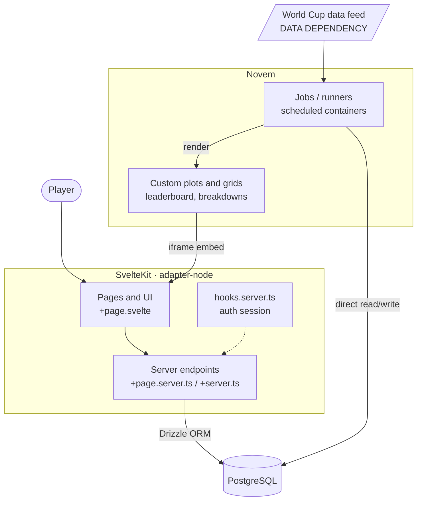
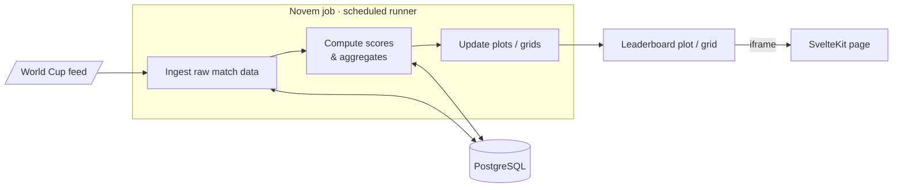

# Architecture

A high-level map of how Startup Fantasy is built and how data flows through it.
For the rules of the game itself, see [game-mechanics.md](game-mechanics.md).
For how we write code, see [CONTRIBUTING.md](../CONTRIBUTING.md).

## At a glance

The system has two halves that share one PostgreSQL database:

- **SvelteKit** owns everything user-facing — sign-up, drafting an XI, locking,
and serving pages.
- **[Novem](https://novem.io/)** owns the analytics and visualization;
computing stats and rendering the leaderboard and score breakdowns, which are
embedded back into the SvelteKit UI as iframes.



## Division of responsibility

| Concern | Owner | Notes |
| ------- | ----- | ----- |
| Sign-up, sessions, identity | SvelteKit | Better Auth |
| Draft, validation, lock | SvelteKit | Server endpoints + Drizzle |
| Serving pages and app shell | SvelteKit | `adapter-node` |
| Stat / score computation | Novem jobs | Scheduled runners with direct DB access |
| Leaderboard & breakdown visuals | Novem plots/grids | Embedded as iframes in SvelteKit pages |
| Source of truth (data) | PostgreSQL | Shared by both halves |

The contract between the two halves is the **database schema**, not an API.
SvelteKit writes game state (teams, selections, locks); Novem reads it,
computes, and writes back derived stats and points. Keeping the schema clear
and stable is what keeps these two systems decoupled.

## Tech stack

| Concern        | Choice                  | Notes                                              |
| -------------- | ----------------------- | -------------------------------------------------- |
| Framework      | SvelteKit (Svelte 5)    | Runes mode is forced project-wide (`svelte.config.js`). |
| Language       | TypeScript              | Strict; `pnpm check` runs `svelte-check`.          |
| Styling        | Tailwind CSS v4         | With the typography and forms plugins.             |
| Database       | PostgreSQL              | Local instance via Docker (`compose.yaml`).        |
| ORM            | Drizzle                 | Schema in `src/lib/server/db/schema.ts`.           |
| Auth           | Better Auth             | Email & password today; Google login planned (FR-1). |
| Server runtime | Node (`adapter-node`)   | Builds to a standalone Node server.                |
| Visualization  | Novem                   | Jobs compute stats; plots/grids render them.       |

## SvelteKit application

### Routing & rendering

SvelteKit uses file-based routing under `src/routes/`. Each route can have:

- `+page.svelte` — the UI component, rendered on server and hydrated on client.
- `+page.server.ts` — server-only load functions and form actions (data access,
validation).
- `+server.ts` — JSON/HTTP endpoints when a route is an API rather than a page.

Keep data access and validation in the server files; treat `.svelte` components
as presentation. This is where [locality of
behavior](../CONTRIBUTING.md#locality-of-behavior) pays off — a feature's UI,
its loader, and its actions live in the same route folder.

### Server boundary

Anything under `src/lib/server/` is server-only and must never be imported into
client code — SvelteKit enforces this. The database client, auth configuration,
and any secrets live here.

- `src/lib/server/db/index.ts` — the Drizzle client, constructed from `DATABASE_URL`.
- `src/lib/server/db/schema.ts` — the application schema. Edit this, then `pnpm db:push`.
- `src/lib/server/db/auth.schema.ts` — generated by Better Auth (`pnpm auth:schema`). Do not hand-edit.
- `src/lib/server/auth.ts` — Better Auth configuration.

### Authentication

Better Auth manages identity and sessions. `hooks.server.ts` resolves the
session on each request and makes it available to load functions and actions.
The PRD calls for Google social login in v1 to guarantee one verified identity
per person (the integrity goal); the current scaffold ships email & password,
which is the fallback. See [FR-1](game-mechanics.md#fr-1--sign-up--identity).

## Novem (analytics & visualization)

[Novem](https://novem.io/) is a data-visualization platform for coders. We use
two of its building blocks:

- **Jobs (runners)** — code (typically Python) kept in a Novem repo and run in
isolated, scheduled Docker containers. These are where stat computation lives.
A runner connects **directly to the PostgreSQL database**, reads raw match data
and game state, computes the leaderboard and per-player/per-match breakdowns,
and updates the corresponding Novem visualizations.
- **Custom plots & grids** — the rendered visuals (a grid is a dashboard
composed of plots). Each renders in its own iframe and can be shared publicly
or scoped to the org, so SvelteKit pages embed them directly.



Because the runners own computation and the database is the shared contract,
the two scoring properties from the PRD
([FR-5](game-mechanics.md#fr-5--automated-scoring-data-dependency)) become
properties of the job:

- **Idempotent** — re-running a job on the same input produces the same result.
- **Recomputable** — corrected input re-runs cleanly and overwrites stale
totals. This is how we recover from bad feed data given there is **no admin
UI** (see [User Roles](game-mechanics.md#4-user-roles)).

> Why this split? Novem already provides scheduled compute with database access
> plus a hosted, shareable visualization layer. Letting it own the analytics
> keeps SvelteKit focused on the interactive user experience, and keeps the
> heavy aggregation off the request path.

## Data model

The schema in `src/lib/server/db/schema.ts` is the source of truth and the
contract between SvelteKit and Novem. The target shape is described in the
PRD's [Data Model Hints](game-mechanics.md#8-data-model-hints). The defining
decision there is the **separation of raw stats from computed points**:

- `PlayerMatchStat` holds the raw facts from the data feed (goals, assists,
cards, clean sheet, MotM).
- `PlayerMatchScore` holds points derived from those facts via the scoring
table.

Because points are always recomputable from stored raw stats, a Novem runner
can patch bad feed data and re-run — which matters because v1 has no admin UI.
Tunable values (budget cap, ownership cap, deadline, transfer settings) belong
in a config/settings table, not hardcoded, so they can change without a deploy.

## Environments & deployment

- **Local:** PostgreSQL via `pnpm db:start` (Docker), app via `pnpm dev`. See
the [README](../README.md).
- **Build:** `pnpm build` produces a Node server through `adapter-node`.
- **Config:** environment variables (`DATABASE_URL`, `BETTER_AUTH_SECRET`,
`ORIGIN`) — see `.env.example`. Never commit `.env`.
- **Novem:** jobs are deployed from a Novem repo and scheduled (cron); the
database connection and any secrets are supplied as job environment variables,
never hardcoded.

## Where things live

```
src/
├── routes/                     # Pages + endpoints (file-based routing)
│   └── <feature>/
│       ├── +page.svelte        # UI (embeds Novem iframes where needed)
│       ├── +page.server.ts     # loaders + form actions
│       └── +server.ts          # JSON endpoints (when needed)
├── lib/
│   └── server/                 # Server-only code (never imported client-side)
│       ├── auth.ts             # Better Auth config
│       └── db/                 # Drizzle client + schema (the Novem contract)
└── hooks.server.ts             # Per-request hooks (auth session)
docs/                           # This directory
```

Novem job code lives in a separate Novem repo, not in this repository.
